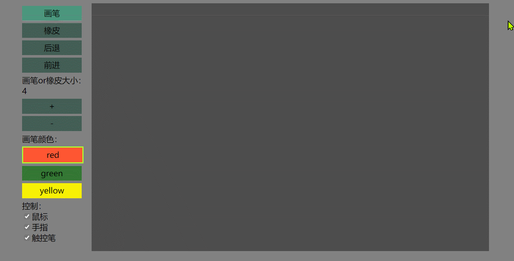

## html5绘板工具示例
html5绘板工具示例， 无依赖。支持识别手指和触控笔；支持识别触控笔支持压感(0-1)；支持多点触控绘制；支持识别surface pen的橡皮擦。

[点击体验](https://xninemoon.github.io/html-drawer/index.html)



## 开发

编译： 在根目录下执行如下命令即可进行编译
```
tsc
```

## 参考文档
阅读这篇[参考文档](./docs/dev_note/note.md)，有助于理解本程序
